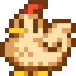

     

<h2 align="center">👋 Hi there!</h2>
 

  

 

<h2 align="center">👨‍💻 Skills :</h2>
 

  
  
  
  
  
  
  

 
<h2 align="center">📊 GitHub Stats :</h2>
 

  
  
  

    

<h2 align="center">🌐 Networks :</h2>
 

  
  
  

 
<h2 align="center">📌Pinned repositories :</h2> 
 
